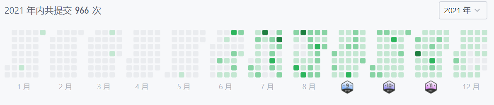

# 大龄程序员找工作之旅
## 前言
入职MS两周多了，融入的很快，前公司也是外企，所以各方面都很适应。工作上手也挺快，已经开始提交代码，review代码的过程很详细，一个feature前前后后28个comments，以前没写过C#，也让我好一番折腾，不过总算一周多搞定了。  
外企年底都不忙，也有时间整理一下这几个月的找工作的历程和一些感悟。

## 裁员 

80后，40+，大家差不多知道是哪年的了，研究生毕业之后呆过两家外企，在大O呆了十余年，主要做通讯领域的Java开发。大O在两三年前就开始裁员，大陆只剩下南京这大几十号人偏安一隅。虽然知道早晚有这一天，但是这一天来临的时候还是压力剧增。老板一直口风很紧，直到三四月份才告知site的预算没了，外企财年是到年中，所以如果老板不批新的预算，最迟6月底就要拜拜了。美国老板虽然死活不给准信，各种交接催的很紧，但是大家都明白6月应该要裁员了。  
我在四五月份的时候心里还是没底的，不知道该怎么找工作，当时按照6月份出去找工作的计划，也只能准备一些八股文面经。这几个月在心慌焦虑中度过。  
不过转机就在这时来临，印度疫情肆虐，几乎不能正常工作。产品deliver的压力陡增，交接几乎不能正常进行，老板们决定再延期几个月，到九十月份。这给了我喘息的机会，我心里也重新燃起了斗志，为啥不试试很多大厂的机会了，都到这时候了，还有啥不能拼的呢。

## 面试准备
知道了大概工作截止时间之后，我开始制定找工作计划：
1. 地点放宽到南京之外，长三角一带。
2. 看看哪些大厂有同学，比较容易推荐。初步的目标是大厂都试试看，字节，B站，MS，Dell EMC。
3. 开始准备算法，大厂算法是绕不过的坎。  
4. 找云相关或者互联网相关的岗位，可以转Go。

6月开始准备，复习数据结构，开始刷力扣。一开始比较痛苦，知识不成体系，什么BFS，DFS，动归，只听说过这些名词，但是完全没有概念。硬着头皮刷，但是遇到需要运用高阶算法技巧的题目，效果不好。（面试考这些算法也不多，更多是基础，但是掌握这些会给你信心。）B站左程云的视频，极客时间的算法训练营都给了我很大帮助。同时针对一些薄弱环节，再看一些大神刷题笔记。  
这样我从6月刷到了9月，也慢慢有了信心.  

6月到9月大概提交了700多次，刷了将近200题，有些题目各种方法刷了好几遍。  
B站复习了清华大学的操作系统课程，看了一些云原生的技术。同时我也给项目组分享了Linux IO, Epoll, Java NIO，Mysql等八股，分享也是检验自己的知识掌握程度最好的办法。
通过这几个月的系统学习，让我有了明显的提升。以前工作用到的很多技术也开始有点融会贯通的感觉，做到了知其所以然。

## 长长的面经
很大同事8月份就开始找工作了，我并没有着急。我继续按照我的进度，学习到了九月中旬。然后开始写简历，开始寻找机会。我的第一面就这么开始了。
### 币安 Go和公有云开发相关的岗位
这个机会是算法群认识的一个哥们推荐的。
#### 一面
1. 算法题: 求数组中的最大的unique数。 排序暴力解，hash表优化解。
```
nums = [5,7,3,9,4,9,8,3,1] => 8
```  

2. 算法题：求二叉树最后一层的节点个数。BFS遍历，秒解。 
3. Kubernetes的服务请求request的流转过程。
4. service mesh相关的技术
5. mysql的索引
6. redis aof rdb

#### 二面
二面的面试官看我工作很多年，一面也过了，完全没面技术，全是开放性问题。
#### 三面
主面项目经历。

总结： 虽然一面算法不是很难，但是给了我信心。redis因为没咋用过，后面补全了这个知识点。
第三面的项目经历，我讲了太多我在公司前七八年做的通讯领域的技术，而没有说太多后面几年关于微服务，K8S相关的东西。最后对方觉得可能工作经验不是太匹配，而且没有Go的经验。9月28号面完，当时就知道机会不大了。

### 字节
找同学内推的，效率很高，投了之后，第二天就联系面试。
#### 一面
同学系统里查到有南京的职位，就投了南京的。安排在晚上8点，果然是够卷。聊了我的项目四十分钟，感觉也没啥想问我的了，也没啥深入的技术交流，预期中的什么算法通通没有。有点拉低我对字节的印象分，这种面试没啥营养，纯粹浪费时间。面试官跟我聊的还不错，说我超出他的职位要求。大公司就是不一样，年龄歧视说的很隐晦。说推荐我别的职位。后来HR又把简历转到了上海，节后有个人电话跟我聊了十分钟，想看看职位匹配程度，也没有下文了。我简历都写全栈了，还要匹配啥。总之，我对字节拉低了好多印象分。

### Epam
也是技术群认识的推荐的，这个面试是我最后悔的，完全是浪费我时间。
先给了我一个题目，说是三个小时，我一看需求实现一个天气查询接口，还有代码+UT，至少两天的活，我就没做。大家可以看看项目，[项目Github地址](https://github.com/aaronhu922/WeatherService)， 里面有需求，评判一下工作量。
后来HR打电话说，让我十一有时间做做。 于是我十一花了两天时间做完了。后来证明这纯粹浪费我时间，两天时间我可以刷很多题目和八股了。

#### 一面
10月13日，也是唯一一面，一个中国的经理，先中文热乎了一下，然后就开始纯英文面一小时。虽然我英文也不错，跟他聊了一个小时，但是我觉得有点太装B了。又不是外国人，检测一下英文水平就行了，用英文聊技术，能聊个啥。果然，基本上技术问题都是浅浅的一带而过，就问你用过这个框架没，用过那个技术没。稍微有点难度的就是 设计一个cache，要有哪些api。我给了lru策略，hashmap+双向linkedlist实现，针对淘汰策略进行优化，怎么解决缓存穿透。后来也没有消息了，推荐我的人看了反馈，就是技术列表打钩。这能面出个啥水平，不过本来也是外包公司，想想也不奇怪。永久拉黑。

